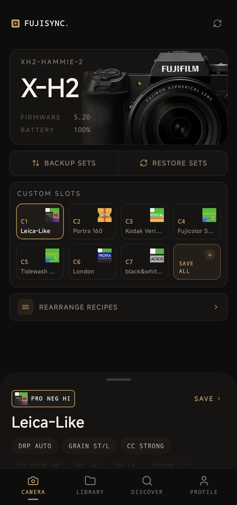
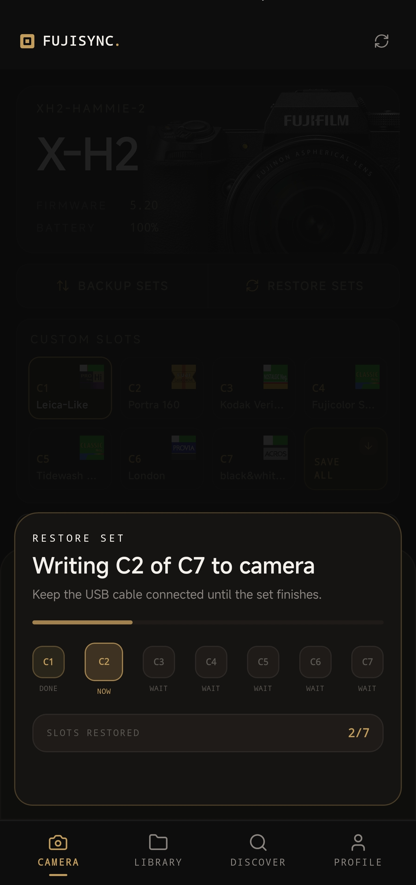
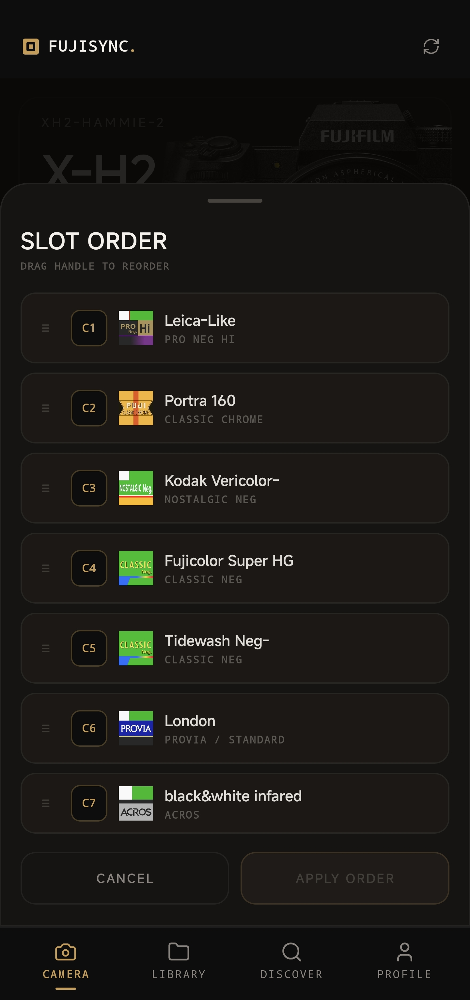
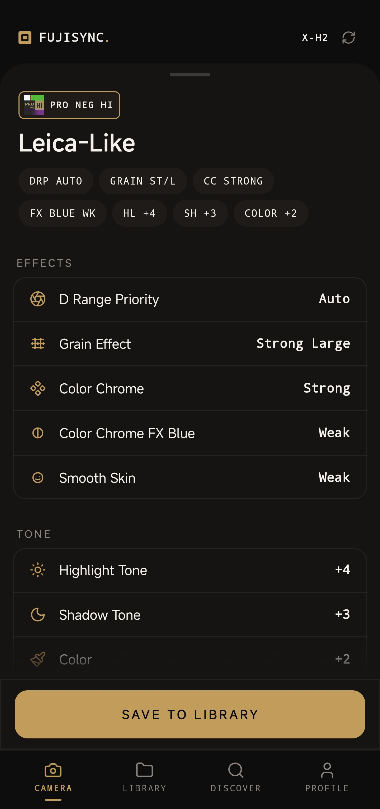
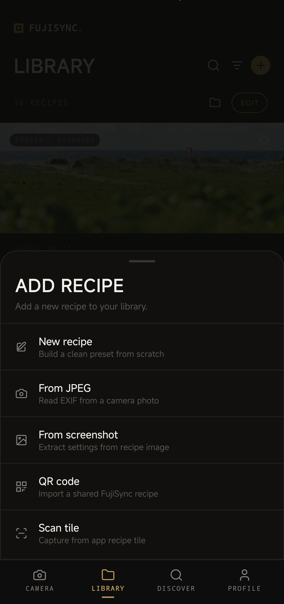
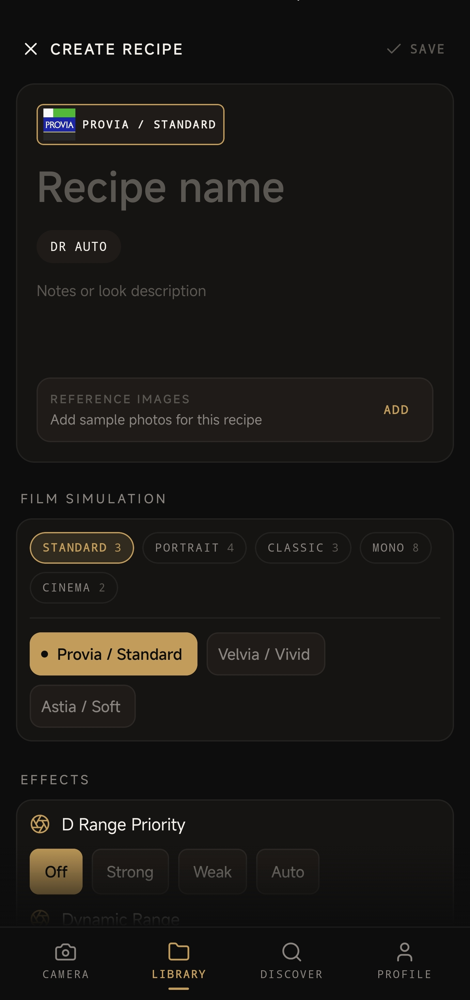
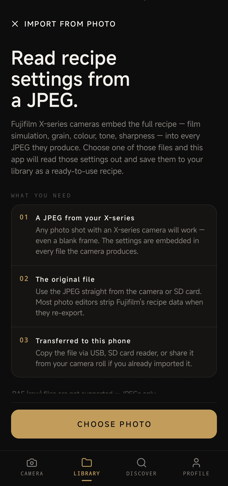
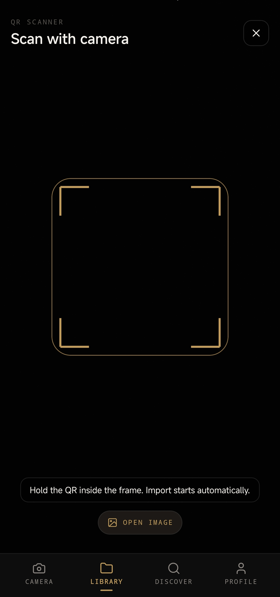
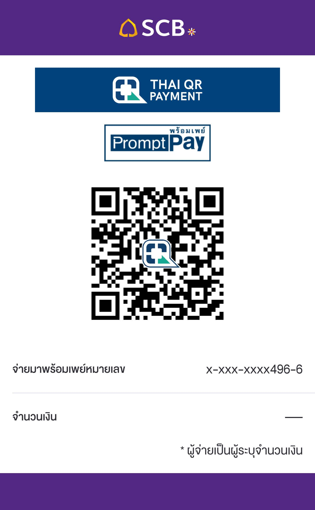

# FujiSync — Fujifilm Recipe Manager for Android

**Read, edit, and push film simulation recipes to your Fujifilm X-series camera over USB-C.**

[](LICENSE)
[](https://developer.android.com/about/versions/oreo)
[](https://buymeacoffee.com/ilfforever)

> Connect your camera over USB-C OTG, pull what's loaded in C1–C7, edit the settings, and push them back. Or build a library of your favorite looks and swap them in whenever you want.

This is a free, open-source Android app for Fujifilm X-series photographers who manage film simulation presets and want a faster alternative to navigating camera menus by hand. Fork it, contribute, suggest features. All welcome.

---

<!-- SCREENSHOT: hero banner or app preview gif, suggested size 1280x640 -->


---

## What is a film simulation recipe?

Fujifilm X-series cameras let you dial in a custom "recipe" — film simulation, grain, tone curve, color saturation, sharpness, white balance — and save it to one of seven slots (C1 through C7). Photographers share these recipes online to recreate the look of classic films or describe a particular vibe. FujiSync is the easiest way to get those recipes onto your camera without navigating through menus by hand.

---

## Who is this for?

If you own a Fujifilm X-series camera and you:

- swap recipes regularly and find menu-diving tedious
- follow the recipe community (Fuji X Weekly, Instagram, YouTube) and want to try new looks fast
- back up your current camera settings before traveling
- shoot JPEG and care deeply about in-camera rendering

...this app is for you.

---

## Screenshots

**Camera & editing** — read your C1–C7 slots, rearrange recipes, and dig into the details.

| Camera Slots | Syncing to Camera | Rearrange | Recipe (expanded) |
|:---:|:---:|:---:|:---:|
| <!-- SCREENSHOT: slot board (MY CAMERA screen) -->  | <!-- SCREENSHOT: restoring/syncing to camera -->  | <!-- SCREENSHOT: rearrange modal -->  | <!-- SCREENSHOT: recipe detail expanded -->  |

**Import** — get recipes into the app from photos, screenshots, or QR codes.

| Add Recipe | Manual Entry | From JPEG | QR Import |
|:---:|:---:|:---:|:---:|
| <!-- SCREENSHOT: add recipe entry point -->  | <!-- SCREENSHOT: manual recipe entry -->  | <!-- SCREENSHOT: JPEG import -->  | <!-- SCREENSHOT: QR import -->  |

---

## Features

### Camera connection
- Plug in any X-series camera via USB-C OTG in **USB RAW Conv. / Backup Restore** mode
- Reads all 7 custom slots (C1–C7): film simulation, grain, tone, color, sharpness, white balance, and more
- Edit any slot and write it back with one tap
- Full backup: save C1–C7 to your phone and restore the whole set at once

### Library
- Save recipes from the camera or build new ones from scratch
- Organize into named groups with cover photos
- Attach reference shots so you remember what the recipe actually looks like
- Duplicate detection keeps things tidy

### Import and sharing
- **JPEG to recipe**: drop any unedited X-series JPEG into the app and it reads the embedded recipe from the Fujifilm MakerNote EXIF data
- **Screenshot to recipe**: on-device OCR reads recipe parameters from screenshots of any recipe app, camera menu, or Instagram post. Works with full labels (`Highlight Tone: -2`) and shorthand (`H -2, SH +1, NR 0`)
- **QR codes**: every recipe can generate a QR code you can share with friends or post online. Scanning one imports the recipe instantly, no internet required. Works completely offline on both ends

### Discover
- Browse and save recipes directly from the Fuji X Weekly community feed

---

## Requirements

| | |
|---|---|
| **Phone** | Android 8.0 (API 26) or newer |
| **Camera** | Fujifilm X-series with custom recipe slots (C1–C7) |
| **Cable** | USB-C to C cable or adapter |
| **Camera mode** | USB Setting > USB RAW Conv. / Backup Restore |

---

## Supported cameras

The app communicates with the camera over the Fujifilm PTP protocol via USB. Most modern X-series bodies with the C1–C7 slot system should work. If you run into issues with a specific body, [open an issue](../../issues) with your camera model.

| Camera | Status |
|---|---|
| X-T5 | Confirmed |
| X-H2 | Confirmed |
| X-Pro3 | Not working |
| *Other X-series* | Likely works, untested |

---

## Download

Grab the latest APK from [Releases](../../releases).

---

## Support

FujiSync is free and always will be. If it saves you time, a coffee is always appreciated.

[](https://buymeacoffee.com/ilfforever)

<details>
<summary>💳 สนับสนุนกันผ่าน PromptPay ได้นะครับ (คนไทย)</summary>

<br>

ถ้าใครใช้แอพนี้เเล้วชอบหรืออยากสนับสนุนให้พัฒนาต่อ โอนเงินมาช่วยซัพพอร์ตเล็กน้อยก็จะเป็นกำลังใจให้ผมได้ทำต่อไปครับ 😊



สแกนตรงนี้ได้เลย ขอบคุณมากๆครับ 🙏

</details>

---

## Film simulation parameters supported

Every recipe parameter the camera exposes over its USB interface:

| Parameter | Range |
|---|---|
| Film Simulation | Provia, Velvia, Astia, Classic Chrome, Reala Ace, Pro Neg Hi/Std, Eterna, Bleach Bypass, Acros, Monochrome, Sepia |
| Grain Effect | Off, Weak Small/Large, Strong Small/Large |
| Color Chrome Effect | Off, Weak, Strong |
| Color Chrome Effect Blue | Off, Weak, Strong |
| White Balance | Auto, Daylight, Shade, Fluorescent, Incandescent, Underwater, Custom 1–3, Color Temp |
| WB Shift R / B | +/−9 |
| Dynamic Range | DR100 / DR200 / DR400 / Auto |
| D Range Priority | Off, Auto, Weak, Strong |
| Highlight Tone | −2 to +4 |
| Shadow Tone | −2 to +4 |
| Color | −4 to +4 |
| Sharpness | −4 to +4 |
| High ISO NR | −4 to +4 |
| Clarity | −5 to +5 |
| Slot name (C1–C7 label) | Up to 22 characters |

---

## Building from source

```bash
./gradlew assembleDebug
```

Open the project root in Android Studio and sync Gradle. No API keys or local config needed for a debug build.

**Release signing** — add to `local.properties`:
```
releaseStoreFile=/path/to/keystore.jks
releaseStorePassword=...
releaseKeyAlias=...
releaseKeyPassword=...
```

### Project layout

```
app/src/main/java/com/ilfforever/fujisync/
├── data/
│   ├── exif/          JPEG MakerNote -> RecipePreset
│   ├── ocr/           ML Kit OCR + regex parser for screenshots
│   ├── local/         JSON persistence (library, slots, settings)
│   ├── mapper/        PTP wire values <-> display dial values
│   ├── ptp/           PTP packet / transaction primitives
│   ├── remote/        FXW community feed API
│   └── usb/           USB OTG scanning, PTP session, camera read/write
├── domain/model/      RecipePreset, FujiPropertyCode, FujiFilmSimulation
└── ui/
    ├── camera/        Slot board, slot detail, connection guide
    ├── detail/        Recipe detail overlay
    ├── editor/        Recipe editor
    ├── library/       Library, groups, sort/filter
    ├── discover/      FXW browse + save
    ├── profile/       Settings, camera labels, import tools
    ├── model/         UI models and mappers
    └── components/    Shared atoms and icons
```

Tech stack:

| Layer | What |
|---|---|
| UI | Jetpack Compose + Material 3, dark-only |
| Architecture | MVVM, Hilt DI, single-module |
| Camera comms | USB OTG, Fujifilm PTP protocol |
| EXIF parsing | `com.drewnoakes:metadata-extractor` |
| OCR | Google ML Kit (on-device, download-on-demand) |
| Storage | JSON flat files in `filesDir` |
| Min SDK | 26 (Android 8.0) |

Community documentation for the Fujifilm PTP protocol is available at [fujifilm-ptp-recipes](https://github.com/ILFforever/fujifilm-ptp-recipes) if you want to build something with it.

---

## Contributing

This started as a personal project and it's staying free. If you find it useful, contributions are genuinely appreciated — whether that's code, bug reports, or just telling me which camera body you tested it on.

**Ways to get involved:**

- **Found a bug?** [Open an issue](../../issues) with your camera model and Android version
- **Have a feature idea?** Open an issue and describe what you're trying to do. Most good ideas come from people actually using the thing
- **Want to contribute code?** Fork the repo, make your changes, and open a pull request. No formal process — just a quick description of what and why
- **Camera not working?** The dev screen in the app can capture raw PTP response bytes. Attach those to an issue and it's usually enough to diagnose the problem

If a recipe parameter reads wrong or a camera model behaves differently, that's worth filing.

---

## Related

- [fujifilm-ptp-recipes](https://github.com/ILFforever/fujifilm-ptp-recipes) — community documentation for the Fujifilm USB/PTP recipe protocol
- [Fuji X Weekly](https://fujixweekly.com) — the recipe community this app integrates with

---

## Disclaimer

This software is provided "as is", without warranty of any kind. Use at your own risk. The author is not affiliated with Fujifilm and accepts no liability for any damage to your camera, loss of data, or any other issues arising from the use of this application. Always back up your camera settings before making changes.

## License

Released under the [MIT License](LICENSE). Free to use, modify, and distribute.

---

Made with ❤️ by [ILFforever](https://github.com/ILFforever)
